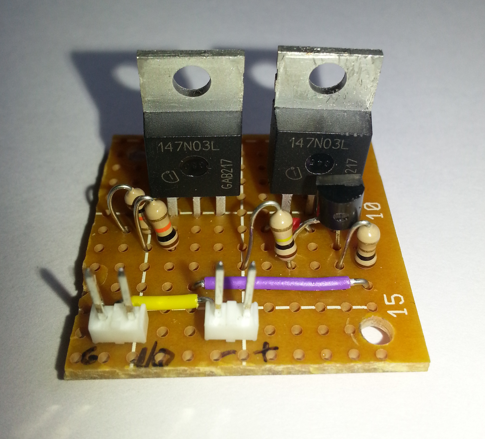
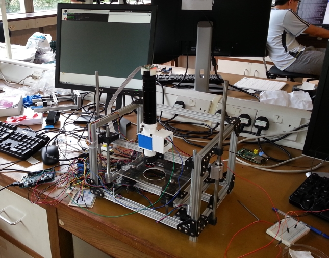

# The Microscope Fluorescence Module 

## Project Overview 
The aim of this project was to develop a fluorescence module to add functionality to the OpenLabTools microscope and to allow it to be utilised for biological applications. 

### Background
Fluorescence is the emission of light by a substance that has absorbed light or other electromagnetic radiation (definition taken from [Wikipedia](http://en.wikipedia.org/wiki/Fluorescence)). The most common type of fluorescence is when ultraviolet radiation, naked to the human eye, is absorbed by a substance and visible light is emitted. This phenomenon allows for tracking of atoms and molecules (such a proteins) in biological systems by marking the substance that is being traced with a fluorophore ([Wikipedia](http://en.wikipedia.org/wiki/Fluorophore): A fluorophore is a fluorescent chemical compound that can re-emit light upon light excitation). Electromagnetic radiation that can excite the fluorophore is used to illuminate the sample which will emit visible light which is observed through a microscope. 

Fluorescent microscopes can cost upwards of tens of thousands of pounds and provide basic microscopes with the capabilities to be used in biological applications. The task was to create a modular component that can be attached to the OpenLabTools microscope to give it the functionality of a more expensive fluorescent microscope. 

### This project
Fluorescein and Green Fluorescent Protein (GFP) were the two primary fluorophores that this fluorescence module was being made for. Therefore, care should be taken when modifying the project to make it work with different fluorophores and take care in ensuring that you use the correct light source and correct set of filters depending on the excitation and emission wavelengths of the fluorophore.

The excitation wavelength of fluorescein is 494nm and GFP has a major excitation peak at 395nm and a minor one at 475nm. This meant that the LED light source used had to accommodate both major excitation peaks and hence a 450nm LED was used as it will emit radiation +/- 50nm allowing it to be used for fluorescein and GFP. The emission wavelength of fluorescein was 521 nm and for GFP it was 509nm. This meant that a long band pass filter (details of the filter used are in the 'Microscope Attachment' section) was used to ensure that only the emission radiation was transmitted to the Raspberry Pi camera.

INIFNITY FOCUSED MICROSCOPE CRAP THING?

This tutorial is split up into two sections:

- Microscope Attachment: this section gives details on the unit that attaches to the rest of the microscope which houses the filters and the lighting unit.
- LED light source for the fluorescence module: this section gives details on the circuit created for the LED along with the software to control its brightness. 

The information in these sections can be modified in any way necessary to suit different requirements and places where factors can be modified has been included in the tutorial.

### Current state of project
The fluorescence module for the microscope was tested by looking at two pieces of tissue paper - one that was the test sample and soaked with distilled water and the other was soaked with fluorescein (it comes in powder form and is dissolved in distilled water).
During testing an issue arose where the Raspberry Pi Camera did not notice the fluorescence as shown by the images below, with the image on the left the test sample without fluorescein and the image on the right the sample with fluorescein:

Looking at the centre of both images we can see that there is no difference between the two samples that were tested. The potential solution to this is to use a condenser lens. However, this assumption could not be verified due to time constraints. The reason this could be the solution is that the fluorescence module does work correctly as can be seen from the images below:

Both images are taken of the tissue soaked in fluorescein with the image on the left taken with the LED light source for the module switched off and the image on the right taken with the LED light source turned on. 

As we can see, the area of the tissue marked with fluorescein shows up clearly when the sample is illuminated with blue light and emits green light as expected. This image was taken with the same set up as above, but the Raspberry Pi Camera lens (that was removed) was used. The reason this works is unclear but it is possible that the lack of a condenser means that without the lens the fluorescein cannot be observed. 

## Microscope Attachment

### Introduction
The unit that attaches to the microscope and houses the two filters and the LED lighting is made through a combination of multiple components, with each component being assembled into the one unit through screws or by being a push fit component. The reason for multiple components being required is that firstly this method provides the easiest access to the filter holders so that the filters can be changed and means the lighting unit can be used a standalone component. Furthermore, combining multiple components would have resulted in difficulties when 3D printing the components which will be explained in detail in the coming sections of this tutorial. 

The microscope attachment was made using OpenSCAD (an open source 3D CAD drawing package) and the files are all stored in the OpenSCADCode folder. The dimensions of key components is stored in the file '	configuration.scad' and this allows the unit to be modified for different applications, such as different screw sizes, different filter sizes, etc. Each OpenSCAD file has instructions at the beginning on how to use it and this information will also appear in this tutorial in the relevant sections. 

NOTE: The one 'hack' in the code is that the filter thickness is set to 1mm and the code needs to be modified such that changing the filter thickness automatically adjusts the sizes of the components to accommodate this. The rest of the code is parametrised and hence other dimensions can be modified easily in 'configuration.scad', and the size of each component will be modified automatically to accommodate this change. 

### Components

The filters used are the two components (excluding the LED circuit components and screws) that are not 3D printed. One filter is positioned at 45 degrees within the main blue cube, which sits between the optical tubes, and is used to direct the light from the LED, which is in the white cube on the side, down towards the sample. The filter used for this was: 

* Band-pass dichroic filter from [Comar Optics](http://www.comaroptics.com/components/filters/dichroic-filters/band-pass-dichroic-filters). The specific one for this project was the '540 IY 116'.

The second filter sits in the top of the blue cube and is used to prevent the blue light from the LED reaching the Raspberry Pi camera sensor that was used for the microscope and only the emission wavelength is allowed through. The filter used for this was:

* Long-pass dichroic filter from [Comar Optics](http://www.comaroptics.com/components/filters/dichroic-filters/long-pass-dichroic-filters). The specific one for this project was the '525 IB 116'.

The other components were 3D printed and a 'configuration.scad' file, split into three key sections, was used to make the system modular and allow the components to be resized for different project requirements:

* Filter dimension variables: this contains all the dimensional information for the filters. Change these variables if you use a different filter to the ones used in this project.
* Main box variables: the dimensional information for the main housing unit, where the filter at 45degrees is slotted in (cube in between the two sections of the optical tube), is set here. This is where the material thickness and the screw diameter dimensions are set. 
* Microscope optics dimensions: this is where the dimensions regarding the optical section of the microscope are set, such as the tube diameter, thread height, etc.

#### Filter Components (refer to file: filterComponents.scad)

There are four key components related to the filters:

* Filter plate which houses the filter
* Filter clip which secures the filter in the filter plate
* The left and right filter grooves into which the filter plate slots into. These grooves are at 45 degrees and are located in the main blue cube. 

To use any of the components, include this OpenSCAD file in your project and simply call whichever component is required: filterPlate(), filterClip(), rightFilterGroove() or leftFilterGroove()

#### Main unit (refer to file: box.scad)

There are three key components in this file, with an subcomponent used by one of the key components: 

* End plates - these are used to connect the cylindrical optical tubes to the main box cube. The top end plate houses the second filter and is why the next component is required,
* Top Filter Plate is where the second filter is housed, and the filter plate from 'filterComponents.scad' is used here. This attaches to the top end plate.
* Main box unit - this is where the first filter sits, and hence contains the filter grooves from 'filterComponents.scad'. It also has a slot for the LED housing unit to slot into. 
* screwHole - this component is utilised by the main box unit and hence can be ignored. 

Detailed instructions on how to use each component can be found in the comments just above the code for each component in 'box.scad'. 

All these components are connected together using eight 3mm screws (four on each end).

#### LED housing unit (refer to file: lightingUnit.scad)

There are three components in here:

* singleLED() - this was a test module made to see if the push fit mechanism would work. This has been included if you simple want to use a single LED connected in series to a resistor because this test component is small. 
* ConstCurrent() - this is the LED housing unit you would need if you use the constant current circuit detailed below. It has a slot for the LED and simply pushes into the main box unit to fit. 
* Cover() - this is the cover for the LED housing unit. (Depending on the argument passed, a cover for both of the above housing units can be created).

The LED constant current circuit is screwed into the ConstCurrent housing unit. There are four holes available, however, due to the design of the LED constant current circuit, only three of them are used. Refer to the next section for more information on the LED constant current circuit. 

## LED light source for the fluorescence module

### Introduction
The following set of instructions will provide you with information on creating a constant current LED circuit that can be dimmed by using an Arduino.
There are two main components of the LED light source:

* Constant current circuit: this part of the light source allows the current through the LED to be constant irrespective of the voltage from the power supply used. 
* Dimming circuit: this part of the light source builds upon the constant current circuit, allowing the LED's brightness to be controlled by using an Arduino.

The constant current circuit is based upon Dan Goldwater's tutorial "Power LED's - simplest light with constant-current circuit", which provided the basis for the constant current dimming circuit produced to be used in the fluorscence module of the microscope. The tutorial can be found at [http://www.instructables.com/id/Power-LED-s---simplest-light-with-constant-current/](http://www.instructables.com/id/Power-LED-s---simplest-light-with-constant-current/).
This tutorial provides in depth explanation into how the circuit works and its benefits and hence it is best to visit that tutorial to gain a better understanding of the circuit.

### Circuit Diagram

### Components Required
* Resistors
	- R1: 100K Ohm resistor
	- R2: 1.0 Ohm resistor
	- R3: 10K Ohm resistor
	- R4: 10K Ohm resistor
* Transistors
	- Q1: NPN BiPolar BJT (Such as 2N3904 available from [Farnell](http://uk.farnell.com/fairchild-semiconductor/2n3904/transistor-npn-40v-200ma-to-92/dp/9846743))
	- Q2: N-Channel MOSFET (Such as 147N03L available from [Farnell](http://uk.farnell.com/international-rectifier/irlb8721pbf/mosfet-n-ch-30v-62a-to220/dp/1740783?Ntt=147n03l&whydiditmatch=rel_default&matchedProduct=147n03l))
	- Q3: N-Channel MOSFET (Such as 147N03L available from [Farnell](http://uk.farnell.com/international-rectifier/irlb8721pbf/mosfet-n-ch-30v-62a-to220/dp/1740783?Ntt=147n03l&whydiditmatch=rel_default&matchedProduct=147n03l))
* LEDs
	- D1: 450nm blue LED (Such as LUMILEDS LXML-PR01-0425 available from [Farnell](http://uk.farnell.com/lumileds/lxml-pr01-0425/rebel-royal-blue-440nm-460nm/dp/2062928))

A few points about the components:

* R2 is the resistor that determines the current flowing through the circuit. The LED current is set by R2, and is approximately equal to 0.5/R2. For this circuit the LED current was set to 500mA.
* R3 was chosen arbitrarily to limit the current at the Gate pin of Q3, and R4 was chosen to match R3. 
* Q3 does not have to the transistor that is stated above. It can be any transistor of choice, as this component is used as a switch to control the LED brightness (more information on this will follow), and this was chosen to be the same as Q2 as there were spare N-Channel MOSFET Transistors.
* D1 needed to be a LED with a wavelength of 450nm in order to successfully excite the two fluorophores this module was being designed for as explained in the earlier sections. Any LED can be chosen as long as its wavelength satisfies the fluorophores excitation wavelength.

### Background
To understand how the constant current circuit part of the lighting unit works, take a look at the tutorial by Dan Goldwater (link is in the introduction). The tutorial provides a comprehensive explanation to how the circuit works and is best to read that to fully understand how the constant current circuit works.

The dimming part of the circuit works in a simple manner. The LED is turned on and off very quickly (so that flickering is not noticeable to the human eye) and the output brightness of the LED is a ratio of the time the LED is turned on to the time it is turned off. This technique described is known as Pulse-Width Modulation (PWM) and is commonly used to control the power supplied to electrical devices. The diagram below (obtained from [Society of Robots](http://www.societyofrobots.com/schematics_h-bridgedes.shtml)) illustrates how PWM is used to control output voltage. 

### Dimming Circuit - Using an Arduino for Pulse-Width Modulation

Arduino boards come with PWM pins which are a number of the digital pins denoted by the '~' symbol. The PWM pin used in this example was Pin 11 on the Arduino Due. In order to utilise PWM from the Arduino pin, rather than using 

`digitalWrite(pinNumber, HIGH/LOW);` 

in order to set the output voltage of the pin to high or low, we need to utilise

`analogWrite(pinNumber, dutyCycle);`

where an dutyCycle is a value from 0-255 that determines the output voltage by varying the time the pin is set to 'HIGH' and 'LOW'.

The circuit utilises transistor Q3 as a switch to the constant current part of the circuit. This means that when Q3's gate pin is set to LOW, there is no current going to the LED, whereas when the gate pin is set to HIGH, current flows in the circuit from the positive terminal of the power supply to the negative terminal of the power supply.
As shown in the circuit diagram the Arduino PWN Pin is used to control the switch (transistor Q3) and turns it on and off rapidly (the Arduino PWM pins have a default frequency of 490Hz). This allows the brightness of the LED to vary depending on the value of the dutyCycle with a dutyCycle of 0 corresponding to the LED being turned off and a dutyCycle of 255 corresponding to the LED being turned on, drawing the maximum current (which is 500mA in this case). 
A key thing to note is that one of the Arduino ground pins MUST be connected to the negative terminal of the power supply in order to have a common ground and complete the circuit. If this is not done, the Arduino will not be able to control the switch and the circuit will not work.

It was interesting to note that PWM could be done on the Arduino without using the analogWrite command by manually controlling the time the digital output pins are set to HIGH and LOW. The code below demonstrates how to emulate PWM on the Arduino without using the analogWrite command:

	void loop()
	{
		digitalWrite(pin, HIGH);
		delay(70);
		digitalWrite(pin, LOW);
		delay(30);
	}

This sets the output voltage to be 70% and reducing the delay time (which is in milliseconds) increases the frequency of PWM. 

NOTE: 

* The Arduino does not provide power to the LED - the pins cannot deal with the large currents required by high power LEDs. 
* The '+' and '-' on the circuit diagram are the positive and negative terminal of an external power supply. 

### Assembling the circuit
The circuit was soldered onto a piece of strip board that was 12 rows by 13 columns (where each contact strip is considered a row) so it slotted into the housing unit for the circuit as show in the images below. 

The circuit is soldered in such a way that the two different parts (constant current and dimming parts) are separated by the white line running through the 7th hole from the left. To the left of the line we have the dimming part and to the right of the line (and including the line) we have the constant current part. This allows for easy testing of the overall circuit, however, it can be easily redesigned as per design requirement.

The two sets of two pin headers are for the Arduino and the power supply. Looking from left to right, the first two pin header is connected to the Arduino, with the left pin connected to a ground pin and the right pin connected to the PWM output pin. The second two pin header is connected to the power supply with the left pin connected to the negative terminal and the right pin connected to the positive terminal.

The diagram below illustrates how the components are positioned on the strip board:

A few points to note:

* The LED is soldered directly onto the strip board and is on the opposite side to the other components.
* To use the top portion of the strip board as a heatsink for the LED (it heats up very quickly when a large current is passed through it), the fourth row of holes from the top (with the edge nearest to LED being the top) is cut (except the fifth and sixth columns, where the LED sits). This means that the top portion can be soldered together and used as a makeshift heat sink. 
* The strip board diagram shows the components (except the LED) shifted one row up. This is intentional and the mistake is in the pictures as the components were accidentally soldered one row down.

The final step to wire the circuit together is to put sockets on wires that will connect the Arduino and the power supply to the headers on the strip board circuit. 

### Code to control the brightness

Now that the hardware has been assembled, a few lines of code are required to control the brightness of the LED via the Arduino. The serial monitor is used to communicate to the Arduino and to send it commands to adjust brightness, getting the value of the brightness and testing the LED. The code is stored under the file name: ArduinoCode/dimLED.ino

NOTE: When using the serial monitor to communicate with the Arduino, ensure that the Line Ending is set as New Line otherwise setting the brightness will not work!

For this project, a web application being developed was used to control the Arduino rather than using a serial monitor. The code required for the web application side is under the file name: microscopeLEDBrightness.py. The file allows the web application to access the function, thereby eliminating the need to use the serial monitor. The file can be built into web application, designed to control a variety of functionality features of the microscope.

## The Final Setup

The complete system, once integrated into the microscope, is shown in the image below:

The beauty of this application is that it can be modified as per the user's requirement. The setup shown, however, is for the particular application of developing a fluorescence module to add functionality to the OpenLabTools microscope and to allow it to be utilised for biological applications.